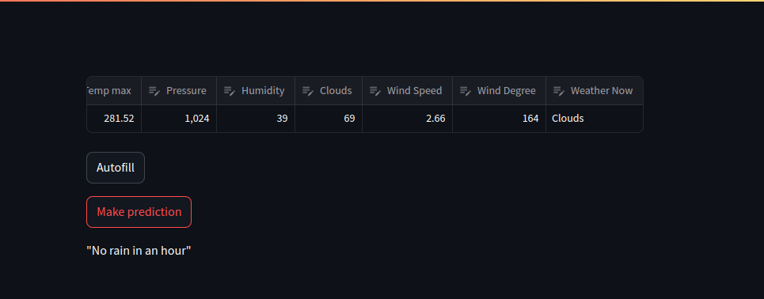

# pmldl_assignment1
## About the project
I chose the weather prediction problem.
This project aims to develop and deploy such model.
## To make this project run with Docker Compose:
1. Create a virtual environment:
```bash
 python -m venv venv
```
2. Activate the virtual environment:
- On Windows:
```bash
 venv\\Scripts\\activate
 ```
- On macOS/Linux:
```bash
source venv/bin/activate
```
3. Install the dependencies:
```bash
 pip install -r requirements.txt
```
4. Navigate to the project directory:
```bash
cd your-project-directory
```
5. Build and Run the Docker Compose command:
```bash
docker-compose --project-directory ./ -f code/deployment/compose.yaml build
docker-compose --project-directory ./ -f code/deployment/compose.yaml up
```
6. Open the Streamlit interface by going to:
```http://localhost:8501```

## How it looks
